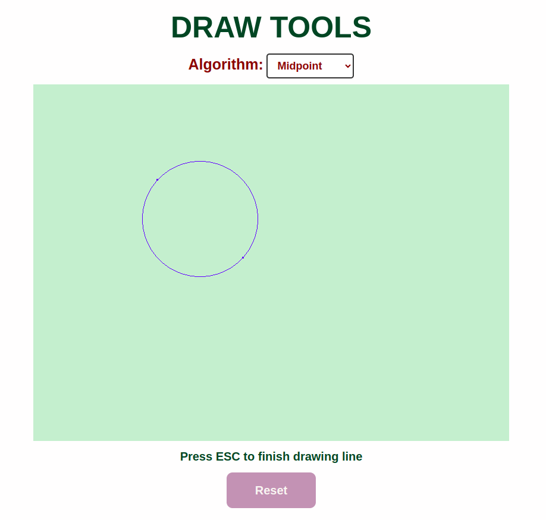

  

<h1 align="center"><b>ĐỒ HỌA MÁY TÍNH</b></h1>

# Giới thiệu
* **Tên môn học:** Đồ họa máy tính - CS105.P22
* **Năm học:** HK2 (2024 - 2025)
* **Giảng viên**: Phạm Cáp Đình Thăng
# Bài tập thực hành
## Lab 1: Các thuật toán vẽ đường thẳng, đường tròn, ellipse
* **Yêu cầu:** Xây dựng các thuật toán vẽ đường thằng (DAA, Bresenham), đường tròn (Midpoint) và Ellipse (2 lần Midpoint trên 1 phần tư cung tròn) bằng `javascript`. Tạo menu trên index.html cho phép người dùng có thể chọn 1 trong 4 thuật toán để thao tác.
* **Kết quả:**

* **Code:** [Lab 01](Lab/Lab_01)

## Lab 2: Phép biến đổi affine trong không gian 2 chiều
* **Yêu cầu:** Xây dựng các phép biến đổi 2 chiều như tịnh tiến, xoay, scale, kết hợp các phép biến đổi với nhau để tạo Animation. Tạo menu trên index.html cho phép người dùng có thể custom theo mong muốn.
* **Kết quả:**

* **Code:** [Lab 02](Lab/Lab_02)

## Lab 3: Đường cong
* **Yêu cầu:** 

  1. Vẽ đồ thị hàm số y = f(x) với f(x) là một đường cong trong [min, max] (đoạn này do người lập trình tự quyết định)

  2. Mô phỏng vẽ đường cong Bezier với các điểm điều khiển nhập từ textbox.

  3. Mô phỏng vẽ đường cong Hermit với 2 điểm và 2 vector được nhập từ ô textbox.

  4. Mô phỏng vẽ hoa n cánh với đường cong tham số .
* **Kết quả:**

* **Code:** [Lab 03](Lab/Lab_03)

## Lab 4: Tiểu luận Fractal
* **Yêu cầu:** 
  1. Tìm hiểu về cách vẽ bông tuyết Vankoch (Koch Snowflake)
  2. Tìm hiểu về cách vẽ đảo Minkowski 
  3. Tìm hiểu về cách vẽ tam giác Sierpinski (Triangles) và Hình vuông Sierpinski (Carpet)
  4. Tìm hiểu và trình bày tập Mandelbrot và Julia Set.
* **Kết quả:**

* **Code:** [Lab 04](Lab/Lab_04)
* **Report:** [Fractal](./Lab/Lab_04/Report.pdf)

## Lab 7: Chiếu sáng + Texture

* **Yêu cầu:** Sữ dụng three.js để vẽ một mô hình bất kì, thêm text ture, chiếu sáng, tạo bóng cho vật thể.
* **Kết quả:**

* **Code:** [Lab 07](Lab/Lab_07)
